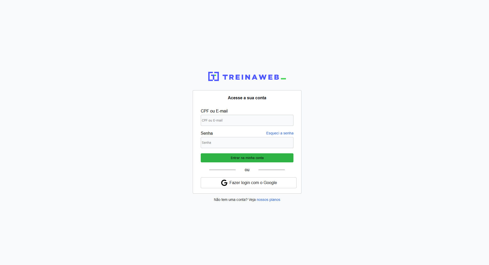

<h1 align="center">👨‍💻 Formulário de Login - Treinaweb </h1>

Link do **[Projeto]()**.

## 💻 Sobre
**Formulário de login**, foi elaborado durante o Curso: **HTML5 + CSS3 - Formulários** da **Treinaweb**.
O objetivo principal deste projeto foi entender como estruturar um formulário em uma página na web. 

## 🚀 Tecnologias
Ferramentas utilizadas durante o projeto:

